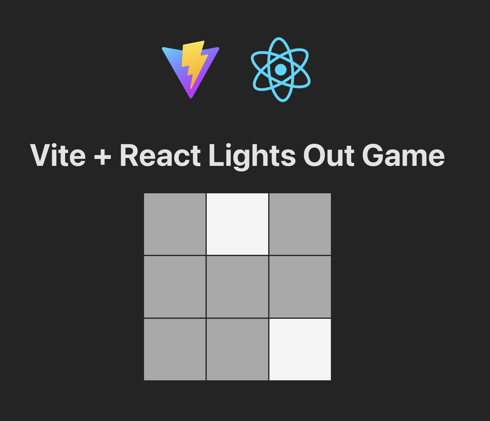
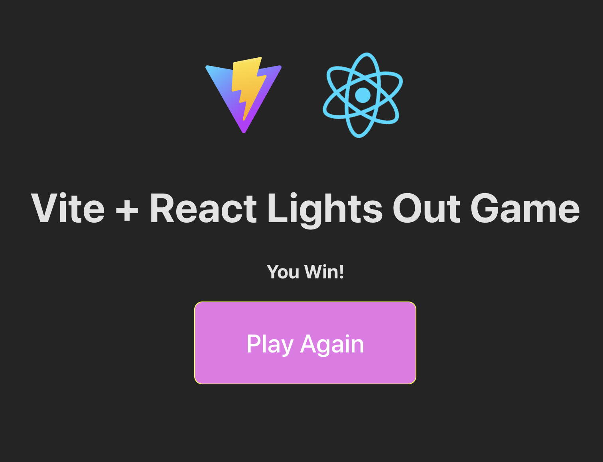

# React + Vite Light Out Game

This template provides a minimal setup to get React working in Vite with HMR and some ESLint rules.

## Table of Contents
- [Project Overview](#project-overview)
- [Images](#images)
- [Installation](#installation)
- [Usage](#usage)
- [Built With](#built-with)
- [Author](#author)
- [Acknowledgments](#acknowledgments)
- [License](#license)

## Project Overview
This project is creating a React application using Vite to create a "Lights Out" game. The game consists of a grid of lights that can be turned on or off by clicking on them. The objective is to turn off all the lights on the board. The rules are as follows:
- Clicking on a light will toggle its state (on/off) as well as the state of its adjacent lights (up, down, left, right).
- The game is won when all lights are turned off.

## Images




## Installation
1. Clone the repository:
   ```bash
   git clone
    ```
2. Navigate to the project directory:
    ```bash
    cd react-vite-template
     ```    
3. Install dependencies:
    ```bash
    npm install
    ``` 

## Usage
To start the development server, run:
```bash
npm run dev
```
This will start the application at `http://localhost:?`.

## Built With
- [React](https://reactjs.org/) - A JavaScript library for building user interfaces
- [Vite](https://vitejs.dev/) - A build tool that aims to provide a faster and leaner development experience for modern web projects
- [ESLint](https://eslint.org/) - A tool for identifying and reporting on patterns found in ECMAScript/JavaScript code
- [Node.js](https://nodejs.org/) - JavaScript runtime built on Chrome's V8 JavaScript engine
- [npm](https://www.npmjs.com/) - Package manager for JavaScript
- [Vitest](https://vitest.dev/) - A blazing fast unit testing framework powered by Vite
- [React Testing Library](https://testing-library.com/docs/react-testing-library/intro/) - Simple and complete React DOM testing utilities that encourage good testing practices

## Author
- Github - [TechEdDan2](https://github.com/TechEdDan2)
- Frontend Mentor - [@TechEdDan2](https://www.frontendmentor.io/profile/TechEdDan2)

## Acknowledgments
The YouTubers and other educational resources I have been learning from include: Coder Coder (Jessica Chan), BringYourOwnLaptop (Daniel Walter Scott), Kevin Powell, Pedro Tech (Vitest tutorial), vairous Udemy courses, Geeks for Geeks, Stack Overflow, and Stony Brook University's Software Engineering Bootcamp (curriculum developed by Colt Steele) 

## License
This project is licensed under the ISC license